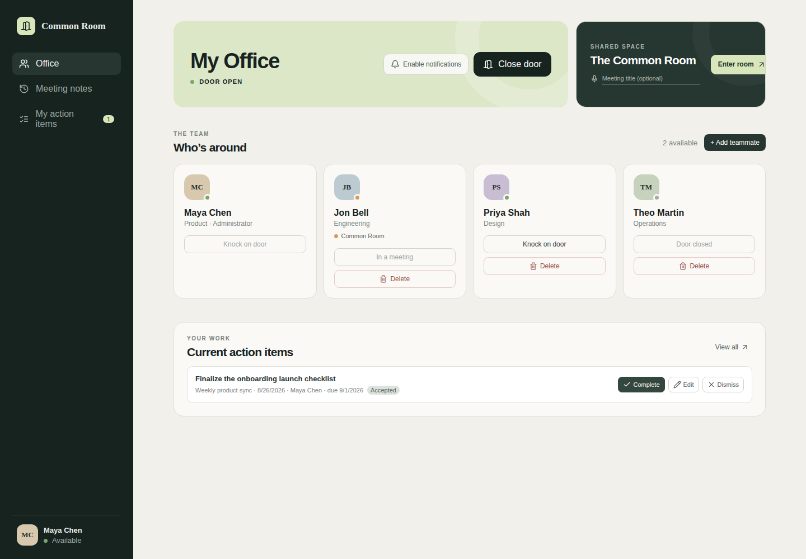

# Common Room

Common Room is a private virtual-office and conferencing application for teams. Each user has an office with an open or closed door, teammates can knock to request a private conversation, and everyone can join the shared Common Room. Calls are audio-first with optional camera and screen sharing.



Public Common Room sessions are recorded, transcribed, summarized, and made searchable across the company. Their action items are assigned to individual users. Private office meetings and their notes remain visible only to their participants.

## Features

- Invite-only accounts with administrator-managed users
- Office presence, door state, occupancy, and knock-to-enter requests
- Public Common Room and private two-person office meetings
- Audio-first calls with optional video and screen sharing
- Browser notifications for knocks and accepted invitations
- Self-hosted Agora audio recording in the background worker
- ElevenLabs transcription
- OpenRouter summaries, decisions, and action-item extraction
- Searchable meeting notes and personal action-item workflow
- Automatic PostgreSQL migrations

## Architecture

This repository is an npm workspace containing:

- `apps/web` — React and Vite browser client
- `apps/api` — Fastify API, authentication, presence, and Agora token service
- `apps/worker` — Docker worker for recording, transcription, and analysis
- `apps/desktop` — Electron desktop client with a workspace-URL onboarding flow
- `packages/contracts` — shared client/server types
- `db` — PostgreSQL schema and migrations
- `render.yaml` — portable Render Blueprint

The web client calls the public API. The API and worker share PostgreSQL. The API mints short-lived Agora channel tokens, while the worker joins active channels as an audio-only recorder. Recordings exist only in the worker's ephemeral `/tmp` storage until successfully transcribed, then they are deleted.

## Provider accounts

A complete production deployment requires:

1. An Agora project with App Certificate authentication enabled. Copy its App ID and App Certificate.
2. An ElevenLabs API key with access to Speech to Text.
3. An OpenRouter API key with access to the model configured by `OPENROUTER_MODEL`.
4. A Render account connected to the Git repository.

The application does not require S3, Redis, or a separate object-storage service.

## Deploy to Render with the Blueprint

The Blueprint creates a static web application, Node API, Docker background worker, and PostgreSQL database.

1. Fork or clone this repository into your Git provider.
2. In Render, choose **New → Blueprint** and select the repository.
3. Apply `render.yaml` and allow Render to create all four resources.
4. Enter the secret values requested during initial Blueprint creation. If Render creates the services before asking for URL values, finish creating them and set the two URL variables in the service dashboards afterward.
5. Configure the environment variables below, save them, and redeploy affected services.

### Web static site

The static site proxies `/api` to the API service through the rewrite in `render.yaml`, so the browser
only ever talks to one origin and the session cookie stays first-party. Confirm the rewrite
destination matches the hostname Render assigned the API service:

```yaml
- type: rewrite
  source: /api/*
  destination: https://common-room-api.onrender.com/api/*
```

Edit it in `render.yaml` and re-sync the Blueprint (or edit the redirect/rewrite rule in the static
site's dashboard) if the hostname differs. Leave `VITE_API_URL` empty so the bundle uses relative
`/api` paths. Setting it to an absolute URL makes the browser call the API host directly, which
needs the cross-site cookie mode described below.

### API web service

Set:

```text
WEB_ORIGIN=https://<your-web-hostname>
AGORA_APP_ID=<your Agora App ID>
AGORA_APP_CERTIFICATE=<your Agora App Certificate>
```

Use the static site's public HTTPS URL for `WEB_ORIGIN`, with no trailing slash. It must exactly match the browser origin because authenticated requests use cookies and credentialed CORS.

If you bypass the rewrite and point `VITE_API_URL` straight at the API hostname, the session cookie
becomes third-party. Also set `CROSS_SITE_COOKIES=true` on the API in that case, which switches the
cookie to `SameSite=None; Secure; Partitioned`. Without it browsers that block third-party cookies
reject the cookie and sign-in silently fails.

The Blueprint supplies `DATABASE_URL` from PostgreSQL and generates `SESSION_SECRET`. Do not copy either value into source control.

### Background worker

Set:

```text
AGORA_APP_ID=<the same Agora App ID used by the API>
AGORA_APP_CERTIFICATE=<the same Agora App Certificate used by the API>
ELEVENLABS_API_KEY=<your ElevenLabs API key>
OPENROUTER_API_KEY=<your OpenRouter API key>
```

The Blueprint also configures:

```text
OPENROUTER_MODEL=openai/gpt-5.6-luna
EMPTY_ROOM_GRACE_MS=10000
```

The worker image builds the pinned Agora Linux Recording Java SDK using JDK 17. Its first Docker build can take several minutes while Maven downloads and compiles the recorder.

### Create the first administrator

After the web and API deployments are healthy, visit the web URL. If the database contains no users, the application displays **Create the first account**. That first account becomes an administrator and can invite or delete other users.

Alternatively, set these variables on the API before its first successful start:

```text
BOOTSTRAP_ADMIN_EMAIL=admin@example.com
BOOTSTRAP_ADMIN_PASSWORD=<a password of at least 10 characters>
BOOTSTRAP_ADMIN_NAME=Administrator
```

The bootstrap variables are only used when the `users` table is empty. Remove the password variable after the account is created.

### Migrations

No separate migration command is required. At API startup, Common Room creates the `schema_migrations` table and applies unapplied SQL migrations from `db` in a transaction.

### Verify the deployment

1. Open `https://<your-api-hostname>/health`. It should report `ok: true` and `database: "connected"`.
2. Open the web site, create the first administrator, and sign in.
3. Invite a second test user and sign in from another browser profile.
4. Join the Common Room from both profiles and confirm two-way audio.
5. Leave the room and watch the worker logs for recording finalization, transcription, and analysis.
6. Confirm that the completed session appears in meeting-note search with its summary and action items.

If the site loads but API actions fail, check the `/api/*` rewrite destination and `WEB_ORIGIN` first. If sign-in appears to succeed but every later request is unauthenticated, the browser is rejecting the session cookie: confirm requests go to `/api` on the web origin rather than to the API hostname, or set `CROSS_SITE_COOKIES=true`. If calls report that calling is not configured, confirm the Agora values are present on both the API and worker. If calls work but notes never appear, inspect the worker logs and confirm the ElevenLabs and OpenRouter keys.

## Custom domains

Custom domains work without code changes. Point the domain at the static site, set `WEB_ORIGIN` to that domain, and leave the `/api/*` rewrite pointing at the API service hostname. Keep the URL on HTTPS and omit trailing slashes.

## Local development

Requirements:

- Node.js 22 or newer
- PostgreSQL
- Agora credentials for real calls

Create the local environment file and install dependencies:

```bash
cp .env.example .env
npm install
npm run dev
```

Create the PostgreSQL database referenced by `DATABASE_URL` before starting. The API automatically runs migrations. The web app runs at `http://localhost:5173` and proxies `/api` and `/health` to `http://localhost:4000`.

Without `DATABASE_URL`, the API starts in an in-memory demonstration mode. Without Agora credentials, the dashboard works but joining a real call returns an integration-not-configured response.

The production recording worker depends on the Agora native SDK included by its Dockerfile. For an end-to-end local recording test, build and run that Docker image with access to the same PostgreSQL database and the worker environment variables. Running `npm run start:worker` directly does not install the native recorder.

## Desktop app

The Electron client is a desktop shell around a Common Room web deployment. On first launch it shows an onboarding screen so the user can select which workspace URL to connect to — a recent workspace, the local Vite app at `http://localhost:5173`, or a custom URL. The chosen address is saved and loaded on later launches. Use **Workspace → Change workspace…** to pick a different URL.

Enter the web URL you normally open in a browser, not the API hostname. The desktop app probes the URL before connecting; if the probe fails, you can still choose **Connect anyway**.

```bash
npm run dev:desktop    # compile the Electron main process and launch it
npm run dist:desktop   # package platform installers into apps/desktop/release
```

GitHub Actions workflow `.github/workflows/desktop.yml` type-checks and tests the desktop package, then builds unsigned Linux, macOS, and Windows installers and uploads them as artifacts. macOS and Windows will show an unsigned-app warning until signing certificates are configured.

## Environment reference

| Variable | Service | Required | Purpose |
| --- | --- | --- | --- |
| `VITE_API_URL` | Web | Optional | Absolute API URL; leave empty to call `/api` on the web origin. Embedded at build time |
| `WEB_ORIGIN` | API | Production | Exact allowed web origin and invitation-link origin |
| `CROSS_SITE_COOKIES` | API | Only without the proxy | `true` sends the session cookie as `SameSite=None; Secure; Partitioned` |
| `DATABASE_URL` | API, worker | Production | PostgreSQL connection string; supplied by Render |
| `SESSION_SECRET` | API | Production | Session signing secret; generated by Render |
| `AGORA_APP_ID` | API, worker | For calls | Agora project identifier |
| `AGORA_APP_CERTIFICATE` | API, worker | For calls | Agora token-signing secret |
| `ELEVENLABS_API_KEY` | Worker | For transcription | ElevenLabs Speech-to-Text credential |
| `OPENROUTER_API_KEY` | Worker | For analysis | OpenRouter credential |
| `OPENROUTER_MODEL` | Worker | No | Analysis model; defaults to `openai/gpt-5.6-luna` |
| `EMPTY_ROOM_GRACE_MS` | Worker | No | Delay before an empty meeting recording is finalized |
| `WORKER_POLL_INTERVAL_MS` | Worker | No | Worker polling interval; defaults to 5000 ms |
| `RECORDING_TEMP_DIR` | Worker | No | Ephemeral recording directory |
| `AGORA_RECORDER_JAR` | Worker | No | Recorder JAR path inside a custom worker image |
| `BOOTSTRAP_ADMIN_EMAIL` | API | No | Creates the initial admin when paired with a password |
| `BOOTSTRAP_ADMIN_PASSWORD` | API | No | Initial admin password; remove after bootstrap |
| `BOOTSTRAP_ADMIN_NAME` | API | No | Initial administrator display name |
| `PORT` | API | No | HTTP port; defaults to 4000 locally and is assigned by Render |
| `NODE_ENV` | API, worker | No | Enables production cookies and PostgreSQL TLS behavior |

Never expose `AGORA_APP_CERTIFICATE`, `ELEVENLABS_API_KEY`, `OPENROUTER_API_KEY`, `SESSION_SECRET`, or `DATABASE_URL` to the browser or commit them to Git.

## Development commands

```bash
npm run dev          # web and API in watch mode
npm run dev:desktop  # launch the Electron desktop client
npm run build        # build all workspaces
npm run typecheck    # type-check all workspaces
npm test             # run tests
npm run dist:desktop # package desktop installers for the current OS
```

### Refresh the README screenshot

The screenshot uses the API's built-in demo data and isolated local ports, so it does not read or modify your development database.

```bash
npx playwright install chromium # first run only
npm run screenshot:readme
```

The command starts temporary API and web processes, captures a 1440 × 1000 browser view, and replaces `docs/common-room.png`.

## Operational notes

- Worker recordings are ephemeral. A worker restart during a live recording can lose that recording.
- A recording is deleted immediately after a valid transcript is saved. Failed transcription attempts retain it temporarily for retry and eventually remove it after the retry limit.
- Public Common Room notes are company-wide. Private office notes are restricted to meeting participants.
- Browser notifications require each user to grant notification permission.
